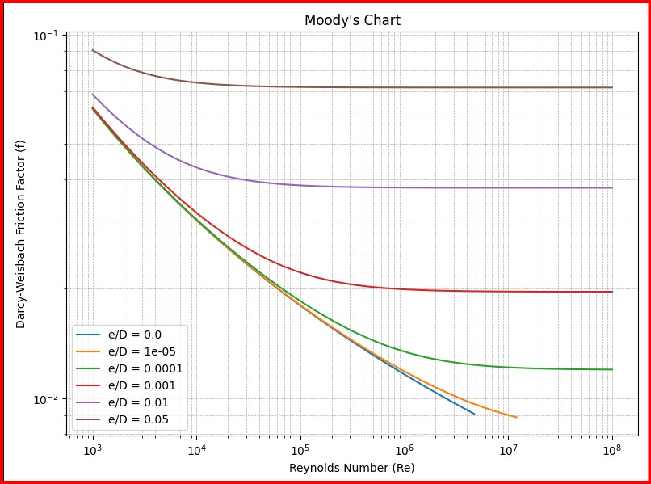

# 🚰 Moody Chart Generator using Colebrook Equation (Python)

This project generates a **Moody Chart** by solving the **Colebrook equation** numerically using the **Newton-Raphson method**. The chart visualizes the relationship between the **Reynolds number**, **relative roughness**, and the **Darcy-Weisbach friction factor** in pipe flow, which is essential in **fluid mechanics** and **hydraulic engineering**.

---

## 📌 Project Overview

The **Moody chart** is a widely used engineering diagram that helps determine the **friction factor** for fluid flow in pipes. The friction factor is critical for calculating **pressure drop** and **energy losses** in pipe systems.

This project:
- Implements the **Colebrook–White equation**, a non-linear equation without a closed-form solution.
- Uses the **Newton-Raphson method** to solve it numerically for various Reynolds numbers and roughness values.
- Plots the results using **Matplotlib** to visualize how the friction factor changes with different flow conditions.

---

## 📈 Output Example

The generated chart displays multiple curves, each corresponding to a different **relative roughness (ε/D)** value.



---

## 🧠 Why It Matters

- In **mechanical**, **civil**, and **chemical engineering**, accurate calculation of pressure drop is crucial in designing efficient pipe systems.
- The Colebrook equation provides a more accurate alternative to empirical approximations.
- This project demonstrates how to apply **numerical methods** and **Python programming** to solve real-world engineering problems.

---

## 🔧 Technologies Used

- **Python 3**
- **NumPy** – for numerical operations
- **Matplotlib** – for plotting the chart

---

## 🗂️ How to Run

1. Make sure you have Python and the required libraries installed:
   ```bash
   pip install numpy matplotlib
